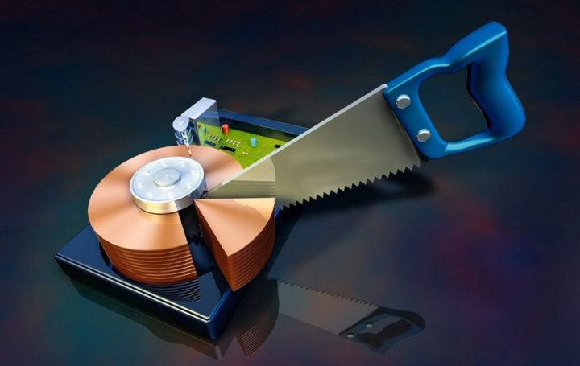

# Guia de instalação do Arch Linux

🛠 Ainda em produção 🛠

## Introdução

Este guia destina-se a ajudar alguém a instalar a distribuição Arch Linux em seu Computador. O guia pressupõe que você tenha alguma familiaridade com o sistema linux e esteja confortável, trabalhando a partir da linha de comando, mas não exige que você seja um especialista. Aprendemos muito fazendo e se você quiser saber mais sobre como o linux opera, o Arch Linux é uma excelente opção por muitas razões.

**Porquê Arch ?**

Uma das maiores vantagens da distribuição Arch Linux é a sua simplicidade na abordagem e atitude. O [Arch Linux Beginner's Guide](https://wiki.archlinux.org/index.php/Installation_guide_(Portugu%C3%AAs)) descreve esta atitude muito bem isso, ele lhe dá a capacidade de construir o seu sistema a partir do zero.

**Os princípios de design por trás do Arch são destinados a mantê-lo simples:**

>«Simples», neste contexto, significa «sem adições, modificações ou complicações desnecessárias». Em resumo; Uma abordagem elegante e minimalista.

**Alguns pensamentos a ter em mente ao considerar a simplicidade:**

> "Simples" é definido de um ponto de vista técnico, não um ponto de vista de usabilidade. É melhor ser tecnicamente elegante com uma curva de aprendizado mais alta, do que ser fácil de usar e tecnicamente [inferior]. "- Aaron Griffin

> "A parte extraordinária de [meu método] reside em sua simplicidade ... A altura do cultivo sempre corre para a simplicidade". - Bruce Lee

### Requisitos

- Conexão com internet (wifi ou cabeada).
- Pendrive [bootável](https://www.balena.io/etcher/) com a iso [Arch Linux](https://archlinux.org/download/)
- Acesso ao boot do sistema. 
- Muita paciência.
- Um pouco de inglês ajuda muito.

# Instalação:


Defina o layout do teclado

	loadkeys br-abnt2

Conecte-se a uma rede wifi

	iwctl device list
	iwctl station wlan0 scan
	iwctl station wlan0 get-networks
	iwctl station wlan0 connect meu_wifi

Caso retorne algum erro tipo ***RTNETLINK answers Operation not possible due to RF-kill*** faça:

	rfkill list all
	rfkill unblock all

Se wlan0 estiver ainda desligada...

	ip link set wlan0 up 	Após isso volte ao procedimento “Conect-se a uma rede wifi”

Teste de conexão

	ping www.google.com 
	
> “ctrl” + “c” para parar o teste

ou
	ping -c 3 www.google.com

> Para o teste após 3 tentativas

Esquema de particionamento, formatação e montagem em disco limpo

nota: o que vc vai mais usar no cfdisk é "new", tamanho número em G para Gib ou M para Mib, "write" e "type" para escrever as modificações

## Particionamento



	cfdisk -z /dev/sda	"para formatar e instalar em todo o HD"

Escreva as partições seguindo o modelo abaixo:

|Partição        |Diretório                      |Espaço                       |Tipo                         |
|----------------|-------------------------------|-----------------------------|-----------------------------|
|/dev/sda1       |`/efi`                   	 | 300Mb                       | efi   			     |
|/dev/sda2       |`/`		    	         | O quanto você quiser        | ext4 			     |
|/dev/sda3       |`swap`             	         | Dobro da RAM                | swap			     |
|/dev/sda4       |`/home`                	 | Restante da memória         | ext4			     |

Formatação

	mkfs.vfat -F 32 /dev/sda1
	mkfs.ext4 /dev/sda2
	mkswap /dev/sda3
	mkfs.ext4 /dev/sda4

Montagem (USE lsblk para fazer checagem)

	mount /dev/sda2 /mnt
	swapon /dev/sda3

Crie a pasta home

	mkdir /mnt/home

Monte a pasta home

	mount /dev/sda4 /mnt/home

Crie e monte a pasta efi

	mkdir /mnt/efi
	mount /dev/sda1 /mnt/efi

Esquema de particionamento formatação e montagem em disco previamento ocupado (com windows 10)

Particionamento

	cfdisk

Escreva as partições seguindo o modelo abaixo:

|Partição        |Diretório                      |Espaço                       |Tipo                         |
|----------------|-------------------------------|-----------------------------|-----------------------------|
|/dev/sda1       |`Windows efi`                  |                             |                             |
|/dev/sda2       |`Microsoft reserved`	         | 			       |                             |
|/dev/sda3       |`Microsoft basic data`         | 		               |                             |
|/dev/sda4       |`Windows recovery environment` | 			       |                             |
|/dev/sda5       |`/efi`                         | 300Mb                       | efi   			     |
|/dev/sda6       |`/`       	                 | O quanto você quiser        | ext4 			     |
|/dev/sda7       |`swap`              	         | Dobro da RAM                | swap			     |
|/dev/sda8       |`/home`	            	 | Restante da memória         | ext4 			     |

Formatação

	mkfs.vfat -F 32 /dev/sda5
	mkfs.ext4 /dev/sda6
	mkswap /dev/sda7
	mkfs.ext4 /dev/sda8

Montagem (USE lsblk para fazer checagem)

	mount /dev/sda6 /mnt
	swapon /dev/sda7

Crie a pasta home

	mkdir /mnt/home

Monte a pasta home

	mount /dev/sda8 /mnt/home

Crie e monte a pasta efi

	mkdir /mnt/efi
	mount /dev/sda5 /mnt/efi

##

Atualize o relógio do sistema

	timedatectl set-ntp true "check usando timedatectl status"

## Instalação e configuração base do sistema

Instale os pacotes essenciais do sistema


`pacstrap /mnt/ base base-devel linux-firmware nano`

Gere o arquivo fstab

	genfstab -U /mnt >> /mnt/etc/fstab

Mude para root

	arch-chroot /mnt

Defina o fuso horário (use "ln /usr/share/zoneinfo/" para encontrar sua região e "ln /usr/share/zoneinfo/America/ para encontrar sua cidade")

Modelo no arch wiki	

`ln -sf /usr/share/zoneinfo/Region/City /etc/localtime`

Exemplo

`ln -sf /usr/share/zoneinfo/America/Maceio /etc/localtime`

Execute hwclock para gerar /etc/adjtime:

	hwclock --systohc

Então vamos editar o arquivo de locales para dizer qual encode de caracteres vamos usar.

Configurando a localização

nano /etc/locale.gen

	Descomente a linha que vai usar(retirar o simbolo de # na frente):
pt_BR.UTF-8 UTF-8

Crie o arquivo locale.conf e defina a variável LANG adequadamente:

	echo "LANG=pt_BR.UFT-8" >> /etc/locale.conf

Gere o "locale" executando:

	locale-gen

Salve o layout do teclado usando:

	echo "KEYMAP=br-abnt2" >> /etc/vconsole.conf

Configuração de rede

Crie o arquivo hostname

	echo "meu_host_name_que_criei" >> /etc/hostname

Adicione as entradas correspondentes ao hosts

	nano /etc/hosts


Defina a senha do root

	passwd

Instale gerenciador de boot (desconsidere os-prober e ntfs-3g se não existir dual com windows)

	pacman -S grub efibootmgr os-prober ntfs-3g

Configure o gerenciador de boot

	grub-install --target=x86_64-efi --efi-directory=/efi --bootloader-id=GRUB
	grub-mkconfig -o /boot/grub/grub.cfg

# DESMONTAR AS PARTIÇÕES E REINICIAR
```
# exit
# umount -R /mnt
# poweroff
```

#

# INSTALAR DISPLAY SERVER
Um display server ou servidor de janela é um programa cuja principal tarefa é coordenar a entrada e saída de seus clientes para o sistema operacional, o hardware e entre eles. Em outras palavras, o display server controla e gerencia os recursos de baixo nível para ajudar a integrar as partes da GUI. Por exemplo, os display server gerenciam o mouse e ajudam a combinar os movimentos do mouse com o cursor e os eventos GUI causados pelo cursor. Mas não se confunda, o servidor de exibição não desenha nada. Eles apenas gerenciam a interface, as bibliotecas, os toolkits e, como você pode ver, eles se comunicam diretamente com o kernel. Vamos usar o [XORG](https://wiki.archlinux.org/index.php/Xorg_(Portugu%C3%AAs))

## Usuário e interface gráfica


Instale os seguintes pacotes

	pacman xorg xorg-server	xorg-xinit xf86-video-intel mesa networkmanager wpa_suplicant dialog pulseaudio i3-gaps dmenu i3status i3blocks alsa-utils

Adicione i3 ao xinit

	echo "exec i3" >> ~/.xinitrc

Habilite o networkmanager

	systemctl enable NetworkManager

Crie usuário, pasta na partição /home e permissões especiais

	useradd -m -G audio,video,storage,wheel -s /bin/bash pessoa1
	passwd pessoa1

Permissão do sudo

	nano /etc/sudoers descomente wheel (ALL) = ALL


## Possíveis erros


```
git clone https://aur.archlinux.org/aic94xx-firmware.git
cd aic94xx-firmware
makepkg -sri

git clone https://aur.archlinux.org/wd719x-firmware.git
cd wd719x-firmware
makepkg -sri

git clone https://aur.archlinux.org/xhci_pci-firmware.git
cd xhci_pci-firmware
makepkg -sri 

mkinitcpio -p linux
```

#

I would recommend you just blacklist the buzzer as there aren’t many times it is useful. You can do this by creating a file called /etc/modprobe.d/nobeep.confwith the contents:

blacklist pcspkr blacklist snd_pcsp

##

Globally
The PC speaker can be disabled by unloading the pcspkr kernel module:

# rmmod pcspkr
Blacklisting the pcspkr module will prevent udev from loading it at boot. Create the file:

touch /etc/modprobe.d/nobeep.conf
blacklist pcspkr


Set up your git config
git config --global user.email "MAIL"
git config --global user.name "NAME"

# SSH
sudo pacman -Sy openssh
sudo systemctl enable sshd
sudo systemctl start sshd

# File editor
pacman -S gedit vim gedit-plugins

pacman -S git bash-completion tk # tk is used by gitk


# PÓS INSTALAÇÃO
>Após a instalação do Arch Linux a única coisa que os usuários vêem é uma linha de comando sem qualquer servidor X, então o usuário deve instalar o X server, uma área de trabalho e alguns outros aplicativos para fazer seu trabalhos diários.

Logue com seu **usuário** e **senha**:
```
$ su
# loadkeys br-abnt2 (para usar o layout abnt2)
```
Conecte a sua rede wireless (Caso tenha)
```
# nmtui
```
Verificar a conectividade com a internet:
```
# ping -c3 www.google.com
```

# INSTALAR DISPLAY SERVER
Um display server ou servidor de janela é um programa cuja principal tarefa é coordenar a entrada e saída de seus clientes para o sistema operacional, o hardware e entre eles. Em outras palavras, o display server controla e gerencia os recursos de baixo nível para ajudar a integrar as partes da GUI. Por exemplo, os display server gerenciam o mouse e ajudam a combinar os movimentos do mouse com o cursor e os eventos GUI causados pelo cursor. Mas não se confunda, o servidor de exibição não desenha nada. Eles apenas gerenciam a interface, as bibliotecas, os toolkits e, como você pode ver, eles se comunicam diretamente com o kernel. Vamos usar o [XORG](https://wiki.archlinux.org/index.php/Xorg_(Portugu%C3%AAs))
```
# pacman -S xorg-server xorg-xinit xorg-apps mesa ttf-dejavu gvfs-mtp
```

# INSTALAR DRIVERS GRÁFICOS
É hora de instalar drivers de vídeo. Eu suponho que você sabe qual GPU você está usando. Se você não sabe qual drive de vídeo você possui, descubra com esse comando:
```
# lspci -k | grep -A 2 -i "VGA"
```
Instale o que for referente ao seu:
```
# pacman -S virtualbox-guest-utils (para Virtualbox)
# pacman -S xf86-video-amdgpu (para placas Amd Radeon)
# pacman -S xf86-video-intel (para placas da Intel)
# pacman -S xf86-video-nouveau (para placas Nvidia) #OpenSource
```
Espera!!! Eu quero instalar o driver proprietário da **Nvidia/ATI**, qual driver devo instalar?
## Nvidia
### ✅ Instale o driver apropriado para a sua placa:
  
  * Para placas da série **GeForce 400 ou mais recentes** [NVCx ou mais recente], instale o pacote `nvidia` ou `nvidia-lts` disponível nos repositórios oficiais.
  
  * Para placas da série **GeForce 8/9 e 100-300** [NV5x, NV8x, NV9x e NVAx], instale o pacote `nvidia-340xx` ou `nvidia-340xx-lts` disponível nos repositórios oficiais.
  
  * Para placas da série **GeForce 6/7** [NV4x e NV6x], instale o pacote `nvidia-304xx` ou `nvidia-304xx-lts` disponível nos repositórios oficiais.
  
  * Para os modelos GPU `mais recentes`, pode ser necessário instalar `nvidia-beta` do `Arch User Repository`, uma vez que os drivers estáveis podem não suportar os recursos recém-introduzidos.
  
  * Se você estiver com sistema de `64 bits` você também precisa de um suporte OpenGL de 32 bits, você também deve instalar o pacote lib32 equivalente do repositório multilib (e.g. `lib32-nvidia-libgl`, `lib32-nvidia-340xx-libgl` ou `lib32-nvidia-304xx-libgl` ).
  
## Ati
 ### ✅ O driver xf86-video-ati (radeon):
   * Funciona com chipsets Radeon até HD 6xxx e 7xxxM (latest Northern Islands chipsets).
   
   * Radeons no HD 77xx  (Southern Islands) as séries são principalmente suportadas. Verifique a matriz de recursos para recursos não suportados.
   
   * Radeons até a série X1xxx são totalmente suportados, estáveis e a aceleração completa 2D e 3D são fornecidas.
   
   * Radeons de HD 2xxx a HD 6xxx têm aceleração 2D completa e aceleração 3D funcional, mas não são suportados por todos os recursos que o driver proprietário oferece.
   
   * Suporta DRI1, RandR 1.2 / 1.3 / 1.4, Glamour, aceleração do EXA e configuração do modo kernel / DRI2.
   
   * Geralmente, o **xf86-video-ati** deve ser sua primeira escolha, independentemente do driver AMD / ATI que você possui. No caso de você precisar usar um driver para drivers AMD mais novos, você deve considerar o driver de catalisador proprietário.
   
 > Nota: xf86-video-ati é especificado como radeon para o kernel em xorg.conf.
 
# ADVANCED LINUX SOUND ARCHITECTURE (ALSA)
Agora, vamos instalar os aplicativos para placa de som:
```
# pacman -S alsa-utils alsa-lib pulseaudio pulseaudio-alsa pavucontrol
```

# INSTALAR AMBIENTE DE TRABALHO
Depois de instalar o servidor X você precisa de um ambiente de um Gerenciador de janelas ou Desktop para fazer seus trabalhos diários!

### `Gerenciadores de Janelas`

I3wm:
```
# pacman -S i3
```
Bspwm:
```
# pacman -S bspwm sxhkd
```
Dwm:
```
# pacman -S dwm
```
Awesome:
```
# pacman -S awesome
```

### `Interfaces Gráficas`
Xfce4 Desktop Environment:
```
# pacman -S xfce4 
```
Budgie Desktop Environment:
```
# pacman -S budgie-desktop
```
GNOME Desktop Environment:
```
# pacman -S gnome gnome-extra
```
Cinnamon Desktop Environment:
```
# pacman -S cinnamon nemo-fileroller
```
KDE Desktop Environment:
```
# pacman -S plasma-desktop kdebase
```
Mate Desktop Environment:
```
# pacman -S mate mate-extra
```
Deepin Desktop Environment:
```
# pacman -S deepin deepin-extra
```
Enlightenment Desktop Environment:
```
# pacman -S enlightenment
```
LXDE Desktop Environment:
```
# pacman -S lxde
```

# DISPLAY MANAGER OU LOGIN MANAGER
Por exemplo, se você estiver instalando o Xfce (DE) você notará que não existe um ambiente de login gráfico. Então, isso significa que você pode fazer login usando a linha de comando e, em seguida, iniciar o Xfce ou instalar um gerenciador de login como o LXDM, que - após um login bem-sucedido - iniciará o Xfce para você.

Exemplo: Lxdm
```
# pacman -S lxdm
# systemctl enable lxdm.service
# reboot
```
Existem outras alternativas como: **Gdm**, **Sddm** etc.

# RECOMENDAÇÕES FINAIS
Caso use um notebook, você deve instalar os drivers do seu touchpad:
```
# pacman -S xf86-input-synaptics
```
