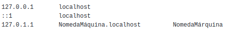
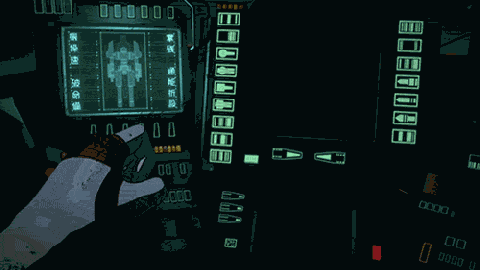

# Guia de instalação do Arch Linux

🛠 Instalação básica completa, ainda falta o guia para interface gráfica 🛠

## Introdução

Este guia destina-se a ajudar alguém a instalar a distribuição Arch Linux em seu Computador. O guia pressupõe que você tenha alguma familiaridade com o sistema linux e esteja confortável, trabalhando a partir da linha de comando, mas não exige que você seja um especialista. Aprendemos muito fazendo e se você quiser saber mais sobre como o linux opera, o Arch Linux é uma excelente opção por muitas razões.

**Porquê Arch ?**

Uma das maiores vantagens da distribuição Arch Linux é a sua simplicidade na abordagem e atitude. O [Arch Linux Beginner's Guide](https://wiki.archlinux.org/index.php/Installation_guide_(Portugu%C3%AAs)) descreve esta atitude muito bem isso, ele lhe dá a capacidade de construir o seu sistema a partir do zero.

**Os princípios de design por trás do Arch são destinados a mantê-lo simples:**

>«Simples», neste contexto, significa «sem adições, modificações ou complicações desnecessárias». Em resumo; Uma abordagem elegante e minimalista.

**Alguns pensamentos a ter em mente ao considerar a simplicidade:**

> "Simples" é definido de um ponto de vista técnico, não um ponto de vista de usabilidade. É melhor ser tecnicamente elegante com uma curva de aprendizado mais alta, do que ser fácil de usar e tecnicamente [inferior]. "- Aaron Griffin

> "A parte extraordinária de [meu método] reside em sua simplicidade ... A altura do cultivo sempre corre para a simplicidade". - Bruce Lee

### Requisitos

- Conexão com internet (wifi ou cabeada).
- Pendrive [bootável](https://www.balena.io/etcher/) com a iso [Arch Linux](https://archlinux.org/download/)
- Acesso ao boot do sistema. 
- Muita paciência.
- Um pouco de inglês ajuda muito.

# Instalação:

Nota, a maior parte desse guia é só seguir a receita `command line` e fazendo para entender melhor então:

Defina o layout do teclado

	loadkeys br-abnt2

Conecte-se a uma rede wifi seguindo os passos abaixo

Faça a checagem da rede

	iwctl device list
	
Se wlan0 estiver ainda desligada...

	ip link set wlan0 up

Caso retorne algum erro tipo ***RTNETLINK answers Operation not possible due to RF-kill*** faça:

	rfkill list all
	rfkill unblock all
	
Para fazer a conexão

	iwctl station wlan0 scan
	iwctl station wlan0 get-networks
	iwctl station wlan0 connect meu_wifi

Teste de conexão

	ping www.google.com 
	
> “ctrl” + “c” para parar o teste

ou

	ping -c 3 www.google.com

> Para o teste após 3 tentativas

## Uma breve explicação sobre partição

Uma partição é uma divisão do espaço de um disco rígido (SCSI ou SATA). Cada partição pode conter um sistema de arquivos diferente. Consequentemente, em cada partição pode ser instalado um Sistema Operativo sendo possível portanto a convivência de vários Sistemas Operacionais na mesma unidade de disco.

Existem diferentes modelos de particionamento, sendo o tipo DOS era o mais conhecido, usado nos computadores PC. Atualmente um tipo que começa a ser difundido é o GPT (GUID Partition Table), usado em conjunto com o UEFI (Unified Extensible Firmware Interface -- padrão criado pela Intel para substituir o BIOS, atualmente mantido por Unified EFI, Inc.). [Para saber mais clique aqui](https://pt.wikipedia.org/wiki/Particionamento_de_disco))

### Esquema de particionamento, formatação e montagem em disco limpo

nota: o que vc vai mais usar no `cfdisk` é "new", tamanho número em G para Gib ou M para Mib, "write" e "type" para escrever as modificações

### Ocupando todo o HD

	cfdisk -z /dev/sda	"para formatar e instalar em todo o HD"

Escreva as partições seguindo o modelo abaixo:

|Partição        |Diretório                      |Espaço                       |Tipo                         |
|----------------|-------------------------------|-----------------------------|-----------------------------|
|/dev/sda1       |`/efi`                   	 | 300Mb                       | efi   			     |
|/dev/sda2       |`/`		    	         | O quanto você quiser        | ext4 			     |
|/dev/sda3       |`swap`             	         | Dobro da RAM                | swap			     |
|/dev/sda4       |`/home`                	 | Restante da memória         | ext4			     |

Formatação

	mkfs.vfat -F 32 /dev/sda1
	mkfs.ext4 /dev/sda2
	mkswap /dev/sda3
	mkfs.ext4 /dev/sda4

Montagem (USE `lsblk` para fazer checagem)

	mount /dev/sda2 /mnt
	swapon /dev/sda3

Crie a pasta home

	mkdir /mnt/home

Monte a pasta home

	mount /dev/sda4 /mnt/home

Crie e monte a pasta efi

	mkdir /mnt/efi
	mount /dev/sda1 /mnt/efi

### Dual boot com windows 10

Esquema de particionamento formatação e montagem em disco <strong>previamento ocupado</strong> (com windows 10)

Particionamento

	cfdisk

Escreva as partições seguindo o modelo abaixo:

|Partição        |Diretório                      |Espaço                       |Tipo                         |
|----------------|-------------------------------|-----------------------------|-----------------------------|
|/dev/sda1       |`Windows efi`                  |                             |                             |
|/dev/sda2       |`Microsoft reserved`	         | 			       |                             |
|/dev/sda3       |`Microsoft basic data`         | 		               |                             |
|/dev/sda4       |`Windows recovery environment` | 			       |                             |
|/dev/sda5       |`/efi`                         | 300Mb                       | efi   			     |
|/dev/sda6       |`/`       	                 | O quanto você quiser        | ext4 			     |
|/dev/sda7       |`swap`              	         | Dobro da RAM                | swap			     |
|/dev/sda8       |`/home`	            	 | Restante da memória         | ext4 			     |

Formatação

	mkfs.vfat -F 32 /dev/sda5
	mkfs.ext4 /dev/sda6
	mkswap /dev/sda7
	mkfs.ext4 /dev/sda8

Montagem (USE `lsblk` para fazer checagem)

	mount /dev/sda6 /mnt
	swapon /dev/sda7

Crie a pasta home

	mkdir /mnt/home

Monte a pasta home

	mount /dev/sda8 /mnt/home

Crie e monte a pasta efi

	mkdir /mnt/efi
	mount /dev/sda5 /mnt/efi

##

Atualize o relógio do sistema

	timedatectl set-ntp true
	
Faça a chegagem

	timedatectl status

## Instalação e configuração base do sistema

Instale os pacotes essenciais do sistema

	pacstrap /mnt/ base base-devel linux linux-firmware nano

Gere o arquivo fstab

	genfstab -U /mnt >> /mnt/etc/fstab

Mude para root

	arch-chroot /mnt

Defina o fuso horário (use "ln /usr/share/zoneinfo/" para encontrar sua região e "ln /usr/share/zoneinfo/America/ para encontrar sua cidade")

Modelo no arch wiki	

	ln -sf /usr/share/zoneinfo/Region/City /etc/localtime

Exemplo

	ln -sf /usr/share/zoneinfo/America/Maceio /etc/localtime

Execute hwclock para gerar /etc/adjtime:

	hwclock --systohc

Então vamos editar o arquivo de locales para dizer qual encode de caracteres vamos usar.

Configurando a localização

nano /etc/locale.gen

	Descomente a linha que vai usar(retirar o simbolo de # na frente):

en_US.UTF-8 UTF-8
pt_BR.UTF-8 UTF-8

Crie o arquivo locale.conf e defina a variável LANG adequadamente (localidade brasileira com mensagens em inglês):

	nano /etc/locale.comf

Escreva:

	LANG=pt_BR.UFT-8

Gere o "locale" executando:

	locale-gen

Salve o layout do teclado usando:

	echo "KEYMAP=br-abnt2" >> /etc/vconsole.conf

Configuração de rede

Crie o arquivo hostname

	echo "meu_host_name_que_criei" >> /etc/hostname

Adicione as entradas correspondentes ao hosts

	nano /etc/hosts

Defina a senha do root

	passwd

Instale gerenciador de boot (desconsidere os-prober e ntfs-3g se não existir dual com windows)

	pacman -S grub efibootmgr os-prober ntfs-3g

Configure o gerenciador de boot

	grub-install --target=x86_64-efi --efi-directory=/efi --bootloader-id=GRUB
	grub-mkconfig -o /boot/grub/grub.cfg

Instale o networkmanager:

	pacman -S networkmanager
	
Habilite-o

	systemctl enable NetworkManager
	
Instale o driver proprietário (placas e processadores intel) e aplicativos para placa de som "ADVANCED LINUX SOUND ARCHITECTURE (ALSA)"

	pacman -S xf86-video-intel mesa pulseaudio alsa-utils

## DESMONTE AS PARTIÇÕES E REINICIE

	exit
	umount -R /mnt
	poweroff

## Configuração de usuário

Crie usuário, pasta na partição /home e permissões especiais

	useradd -m -G audio,video,storage,wheel -s /bin/bash pessoa1
	passwd pessoa1

Permissão do sudo

	nano /etc/sudoers descomente wheel (ALL) = ALL

NetworkManager vem com nmcli e nmtui, mas o nmcli é o mais que suficiente para fazer a tarefa

Exemplos de nmcli
Lista redes wifi próximas:

	nmcli device wifi list

Para conectar a uma rede wifi:

	nmcli device wifi connect NOME_da_REDE password SENHA_da_REDE

## INSTALE DISPLAY SERVER
Um display server ou servidor de janela é um programa cuja principal tarefa é coordenar a entrada e saída de seus clientes para o sistema operacional, o hardware e entre eles. Em outras palavras, o display server controla e gerencia os recursos de baixo nível para ajudar a integrar as partes da GUI. Por exemplo, os display server gerenciam o mouse e ajudam a combinar os movimentos do mouse com o cursor e os eventos GUI causados pelo cursor. Mas não se confunda, o servidor de exibição não desenha nada. Eles apenas gerenciam a interface, as bibliotecas, os toolkits e, como você pode ver, eles se comunicam diretamente com o kernel. Vamos usar o [XORG](https://wiki.archlinux.org/index.php/Xorg_(Portugu%C3%AAs))

	pacman -S xorg xorg-server xorg-xinit

## FINALIZANDO COM A INTERFACE GRÁFICA

KDE e Gnome

<!--
## Preparando a interface gráfica

Instale os seguintes pacotes

	pacman -S i3-gaps dmenu i3status i3blocks ttf-dejavu xterm lightdm light-gtk-greeter git

Adicione i3 ao xinit (nota, se vc fizer isso no modo root, vai ficar somente habilitado no root e provavelmente você vai precisar replicar esse processo no usuário ou simplesmente copiar o arquivo que você criou para o root para pasta home do usuário)

	echo "exec i3" >> ~/.xinitrc

Habilite o lightdm

	systemctl enable lightdm

Instale o AUR helper e em seguida instale o polybar

	git clone https://aur.archlinux.org/trizen.git

	makepkg -si

	trizen -S polybar

-->
