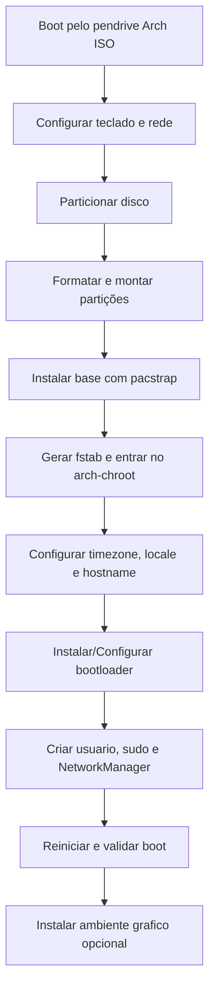

# Guia de instalação do Arch Linux (atualizado com base na documentação oficial)

> Um guia prático, didático e direto ao ponto para instalar Arch Linux com UEFI/GPT, com caminho para desktop (GNOME/KDE) ao final.

Este material foi reestruturado para seguir o fluxo recomendado no **ArchWiki Installation Guide**, mas com linguagem acessível em português, checkpoints visuais e comandos prontos para uso.

---

## 🎯 Painel rápido da instalação

| Etapa | Objetivo | Status esperado |
|---|---|---|
| 1. Boot e rede | Entrar no live ISO e conectar na internet | `ping` responde |
| 2. Particionamento | Criar EFI, root, swap (opcional), home (opcional) | `lsblk` mostra layout |
| 3. Base do sistema | Instalar kernel + pacotes essenciais | `pacstrap` concluído |
| 4. Configuração | Fuso, locale, hostname, initramfs e bootloader | Boot configurado |
| 5. Pós-instalação | Usuário, sudo, rede e desktop | Sistema pronto para uso |

---

## 🧭 Fluxograma (visão geral)


```mermaid
flowchart TD
    A[Boot pelo pendrive Arch ISO] --> B[Configurar teclado e rede]
    B --> C[Particionar disco]
    C --> D[Formatar e montar partições]
    D --> E[Instalar base com pacstrap]
    E --> F[Gerar fstab e entrar no arch-chroot]
    F --> G[Configurar timezone, locale e hostname]
    G --> H[Instalar/Configurar bootloader]
    H --> I[Criar usuario, sudo e NetworkManager]
    I --> J[Reiniciar e validar boot]
    J --> K[Instalar ambiente grafico opcional]
```

---

## 1) Pré-requisitos

- Pendrive com ISO atual do Arch Linux: <https://archlinux.org/download/>
- Boot em modo **UEFI** (recomendado).
- Backup dos dados importantes (obrigatório para evitar perda).
- Internet funcionando (cabo ou Wi-Fi).
- Tempo e paciência 😄

### Validar se está em UEFI

```bash
ls /sys/firmware/efi/efivars
```

Se listar arquivos, você está em UEFI.

---

## 2) Layout do teclado e internet

### Teclado ABNT2

```bash
loadkeys br-abnt2
```

### Rede cabeada

Normalmente já funciona automaticamente.

### Rede Wi-Fi (via `iwctl`)

```bash
iwctl
device list
station wlan0 scan
station wlan0 get-networks
station wlan0 connect "NOME_DA_REDE"
exit
```

Teste da conexão:

```bash
ping -c 3 archlinux.org
```

Sincronize relógio (importante para pacotes/chaves):

```bash
timedatectl set-ntp true
timedatectl status
```

---

## 3) Particionamento (UEFI + GPT)

> Use `lsblk` antes/depois de cada etapa para não errar disco/partição.

```bash
lsblk
```

### Modelo recomendado (instalação limpa)

| Partição | Tamanho sugerido | Sistema de arquivos | Ponto de montagem |
|---|---:|---|---|
| EFI | 512 MiB | FAT32 | `/mnt/boot` |
| Root | 40+ GiB | ext4 | `/mnt` |
| Swap | 2–8 GiB (ou conforme RAM/hibernação) | swap | `swapon` |
| Home (opcional) | restante | ext4 | `/mnt/home` |

### Exemplo com `cfdisk`

```bash
cfdisk /dev/sda
```

- Label: **GPT**
- Criar partições conforme tabela acima
- Tipo EFI para partição de boot

---

## 4) Formatação e montagem

> Ajuste os nomes (`/dev/sdaX`, `/dev/nvme0n1pX`) para o seu caso.

```bash
mkfs.fat -F32 /dev/sda1
mkfs.ext4 /dev/sda2
mkswap /dev/sda3
mkfs.ext4 /dev/sda4
```

Montagem:

```bash
mount /dev/sda2 /mnt
mkdir -p /mnt/boot
mount /dev/sda1 /mnt/boot
swapon /dev/sda3
mkdir -p /mnt/home
mount /dev/sda4 /mnt/home
```

Checklist rápido:

```bash
lsblk
```

---

## 5) Instalação da base do sistema

```bash
pacstrap -K /mnt base linux linux-firmware linux-headers base-devel \
  networkmanager sudo vim nano grub efibootmgr
```

Gerar `fstab`:

```bash
genfstab -U /mnt >> /mnt/etc/fstab
```

Entrar no sistema instalado:

```bash
arch-chroot /mnt
```

---

## 6) Configuração inicial (dentro do chroot)

### Fuso horário e relógio

```bash
ln -sf /usr/share/zoneinfo/America/Sao_Paulo /etc/localtime
hwclock --systohc
```

### Locale

Edite:

```bash
nano /etc/locale.gen
```

Descomente ao menos:

- `en_US.UTF-8 UTF-8`
- `pt_BR.UTF-8 UTF-8`

Gere locales:

```bash
locale-gen
```

Crie `/etc/locale.conf`:

```bash
echo 'LANG=pt_BR.UTF-8' > /etc/locale.conf
```

### Teclado no console

```bash
echo 'KEYMAP=br-abnt2' > /etc/vconsole.conf
```

### Hostname e hosts

```bash
echo 'archlinux' > /etc/hostname
cat > /etc/hosts <<HOSTS
127.0.0.1	localhost
::1		localhost
127.0.1.1	archlinux.localdomain	archlinux
HOSTS
```

### Senha do root

```bash
passwd
```

---

## 7) Bootloader (GRUB UEFI)

```bash
grub-install --target=x86_64-efi --efi-directory=/boot --bootloader-id=GRUB
grub-mkconfig -o /boot/grub/grub.cfg
```

> Em dual boot com Windows, geralmente vale instalar também: `os-prober` e depois regenerar o `grub.cfg`.

---

## 8) Usuário, sudo e rede

Criar usuário:

```bash
useradd -m -G wheel,audio,video,storage -s /bin/bash seu_usuario
passwd seu_usuario
```

Habilitar sudo para grupo wheel:

```bash
EDITOR=nano visudo
```

Descomente linha:

```text
%wheel ALL=(ALL:ALL) ALL
```

Habilite o NetworkManager:

```bash
systemctl enable NetworkManager
```

Finalizar instalação:

```bash
exit
umount -R /mnt
reboot
```

---

## 9) Pós-instalação (opcional): interface gráfica

Depois do primeiro boot, entre com seu usuário e escolha **um** ambiente desktop.

### GNOME

```bash
sudo pacman -S gnome gdm
sudo systemctl enable gdm
```

### KDE Plasma

```bash
sudo pacman -S plasma-meta kde-applications sddm
sudo systemctl enable sddm
```

### Drivers de vídeo (resumo)

- Intel/AMD modernos: `mesa` (geralmente já suficiente).
- NVIDIA proprietária: `nvidia nvidia-utils`.


### Guias detalhados por ambiente gráfico

- [KDE Plasma](kde.md)
- [GNOME](gnome.md)
- [Cinnamon](cinnamon.md)
- [XFCE](xfce.md)
- [i3wm](i3wm.md)
- [i3-gaps](i3gaps.md)

---

## 🧪 Validação pós-instalação

Após reiniciar:

```bash
ip a
ping -c 3 archlinux.org
timedatectl status
```

Se estiver tudo OK: rede ativa, hora correta e boot estável ✅

---

## ⚠️ Notas importantes

- Prefira sempre confirmar comandos no ArchWiki antes de executar em produção.
- Nomes de partições variam entre SATA (`/dev/sdaX`) e NVMe (`/dev/nvme0n1pX`).
- Secure Boot requer passos extras (assinatura/chaves) e não está coberto neste guia.
- Se usar hibernação, ajuste swap de acordo com sua RAM e configure resume.

---

## Referência oficial

- ArchWiki (guia oficial): <https://wiki.archlinux.org/title/Installation_guide>

Se quiser, na próxima atualização eu posso incluir uma seção específica de:
- Dual boot com Windows 11 (passo a passo completo),
- Btrfs com subvolumes,
- Criptografia com LUKS,
- Instalação automatizada com `archinstall`.
